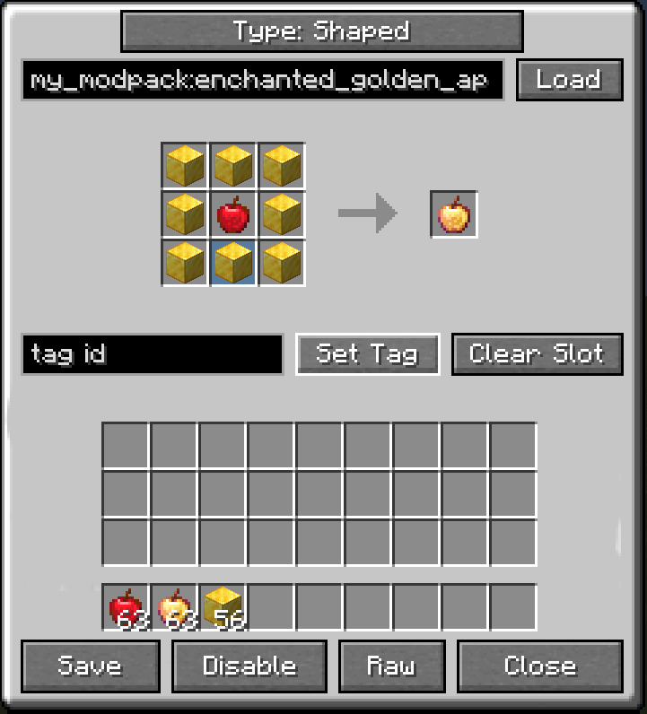

# Simple Craft Editor 🛠️

An in-game editor for Minecraft crafting recipes. Disable recipes, tweak existing ones, or build brand-new ones on the fly — no datapacks, no restarts. Changes take effect immediately.

    

***

## ✨ Features

*   **Disable any recipe** — switch off vanilla or modded recipes. They can no longer be crafted (and leave the JEI/EMI list after a `/reload`), and you can restore them whenever you like.
*   **Edit existing recipes** — change ingredients, results, output counts, cooking time and experience, all from a visual editor.
*   **Create new recipes** — shaped and shapeless crafting, smelting, blasting, smoking, campfire cooking, and stonecutting.
*   **Item tags as ingredients** — use a whole tag (like "any plank") in place of a single item.
*   **Create Mod support** — build any of Create's machine recipes: mixing, crushing, pressing, sawing, bulk washing and the rest, plus the Mechanical Crafter's big grid and multi-step recipe sequences. Output chances, heat requirements and fluid amounts included.
*   **Fluids, not buckets** — Create's machines take fluids by the millibucket, so the editor does too. Drag a fluid in from the recipe viewer or type its id, tags included.
*   **Raw JSON fallback** — any recipe type the visual editor doesn't cover can still be edited as raw JSON, so nothing is off-limits.
*   **Works with JEI & EMI** — drag items and fluids straight from the recipe viewer onto the editor slots, or hover an item and press a key to jump to its recipe. Press again to step through every recipe that makes it.
*   **Fields that help** — id boxes complete as you type, the same way the chat box completes a command, and anything that can't be used shows up in red before you try to save it.
*   **Live and synced** — edits apply instantly for everyone on the server and persist across restarts. Run `/reload` to refresh what JEI and EMI show.
*   **Operator-only** — only operators (or single-player with cheats) can edit, so regular players can't tamper with the pack.

***

## 🎮 How to Use

*   Press **K** to open the editor (operators only). The key can be rebound in Controls.

*   From there you can start a new recipe, or manage your disabled and custom recipes.
*   While a recipe viewer is open, hover any item in **JEI** or **EMI** and press **K** to jump straight to its recipe. If more than one recipe makes it, press **K** again to step through them.

***

## 🌐 Localization

Available in **English** and **Spanish**.

***

## 💬 Links

***

Created by **MateoF024**. Free to include in any modpack, public or private, without asking — see [the licence](LICENSE.txt) for the rest.
