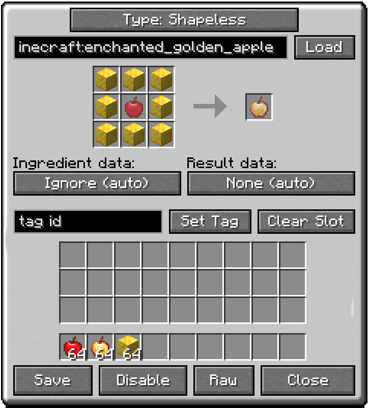

# Simple Craft Editor 🛠️

An in-game editor for Minecraft crafting recipes. Disable recipes, tweak existing ones, or build brand-new ones on the fly — no datapacks, no restarts. Changes take effect immediately.

 

   

 

***

## ✨ Features

*   **Disable any recipe** — switch off vanilla or modded recipes. They can no longer be crafted (and leave the recipe viewer's list after a `/reload`), and you can restore them whenever you like.
*   **Edit existing recipes** — change ingredients, results, output counts, cooking time and experience, all from a visual editor.
*   **Create new recipes** — shaped and shapeless crafting, smelting, blasting, smoking, campfire cooking, stonecutting, and smithing table upgrades.
*   **Item tags as ingredients** — use a whole tag (like "any plank") in place of a single item. The slot shows what the tag actually holds, one item after another.
*   **Data as part of the recipe** — a recipe can require the data on the items you place in the grid, so it works with the chest actually named "Pepito" and not with any chest. The result can carry data too: keep what the ingredients had, bake in what you put in the result slot, or both.
*   **Create Mod support** — build any of Create's machine recipes: mixing, crushing, pressing, sawing, bulk washing and the rest, plus the Mechanical Crafter's big grid and multi-step recipe sequences. Output chances, heat requirements and fluid amounts included.
*   **Cobblemon support** — the campfire pot's recipes, with the seasoning rules: which item tag a player may add to the pot, and which of the seven properties the finished dish takes from it.
*   **Fluids** — Create's machines take fluids by the millibucket, so the editor does too. Drag a fluid in from the recipe viewer or type its id, tags included.
*   **Raw JSON fallback** — any recipe type the visual editor doesn't cover can still be edited as raw JSON, so nothing is off-limits.
*   **Works with JEI, EMI and REI** — drag items and fluids straight from the recipe viewer onto the editor slots, or hover an item and press a key to jump to its recipe. Press again to step through every recipe that makes it.
*   **Live and synced** — edits apply instantly for everyone on the server and persist across restarts. Run `/reload` to refresh what the recipe viewer shows.
*   **Operator-only** — only operators (or single-player with cheats) can edit, so regular players can't tamper with the pack.

> **Note:** recipes created by script mods can't be edited. Those scripts rewrite their recipes every time the pack loads, so any change made here would be undone — the editor says so rather than letting you make one that won't last. Change the script instead. Recipes from datapacks, from the game and from other mods work as normal.

***

## 🎮 How to Use

*   Press **K** to open the editor (operators only). The key can be rebound in Controls.

*   From there you can start a new recipe, or manage your disabled and custom recipes.
*   While a recipe viewer is open, hover any item in **JEI**, **EMI** or **REI** and press **K** to jump straight to its recipe. If more than one recipe makes it, press **K** again to step through them.
*   Hold **Shift** and press **K** over an item that has no recipe to start one that makes it.

***

## 📦 Compatibility

Requires **[Architectury API](https://modrinth.com/mod/architectury-api)**. Everything else is optional: install it and the editor picks it up, leave it out and nothing changes.

| | |
| --- | --- |
| **Recipe viewers** | JEI, EMI, REI |
| **Recipe types** | Create, Cobblemon |
| **Known to work beside** | KubeJS, CraftTweaker, Polymorph, FastSuite, FastWorkbench, FastFurnace, Fast Recipe Search, Sophisticated Backpacks |

***

## 🌐 Localization

Available in **English** and **Spanish** — Spain, Argentina, Chile, Ecuador, Mexico, Uruguay and Venezuela.

***

## 💬 Links

***

Created by **MateoF024**. Free to include in any modpack, public or private, without asking — see [the licence](LICENSE.txt) for the rest.
